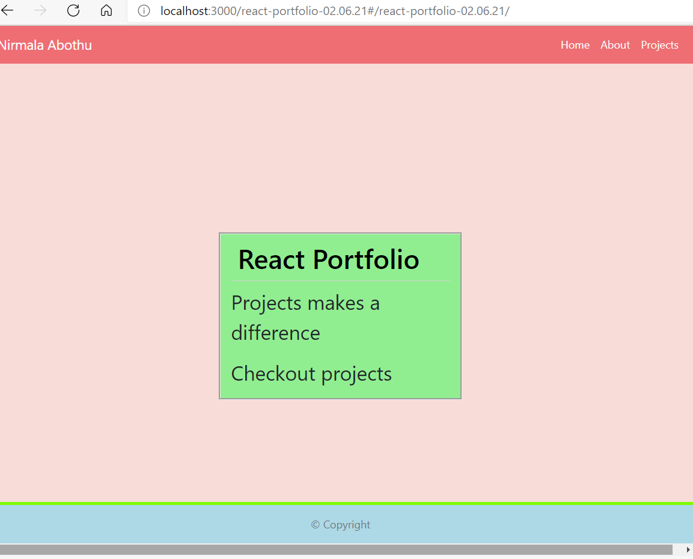

# react-portfolio-02.06.21

---

## About The Project

---

---

---

---

---

---

---

Updated existing portfolio project with following:

1. [GitHub Profile](https://github.com/NirmalaAbothu)
2. [Updated Resume](Assets//Resume/Resume*Nirmala* Abothu_R.pdf)
3. [LinkedIn](https://www.linkedin.com/in/nirmala-abothu-170a7435/)

## Technology used:

-    React JS
-    React Routes
-    HTML and CSS

To get a local copy up and running follow below steps.

## Prerequisites

None

## Installation

Clone the repo
git clone git@github.com:NirmalaAbothu/react-portfolio-02.06.21.git

## License & copyright

Copyright © 2020 Nirmala Abothu

## Deployed project link

[React Portfolio](https://nirmalaabothu.github.io/react-portfolio-02.06.21/#/)
